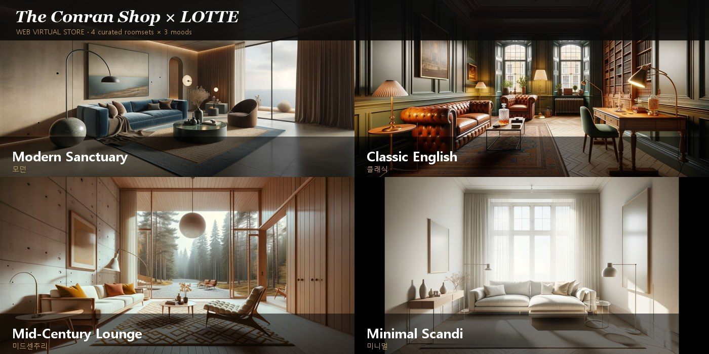
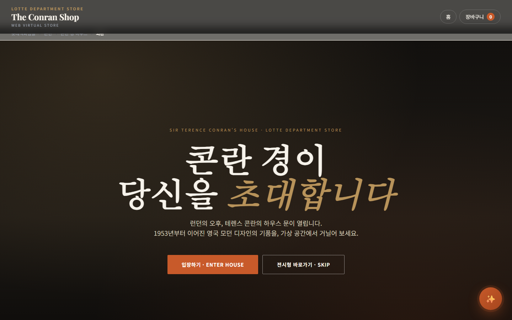
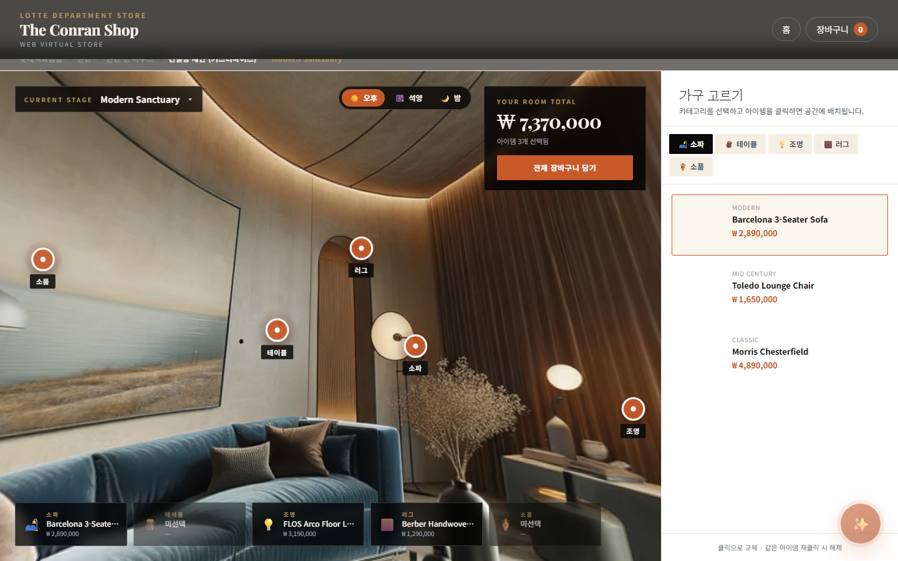
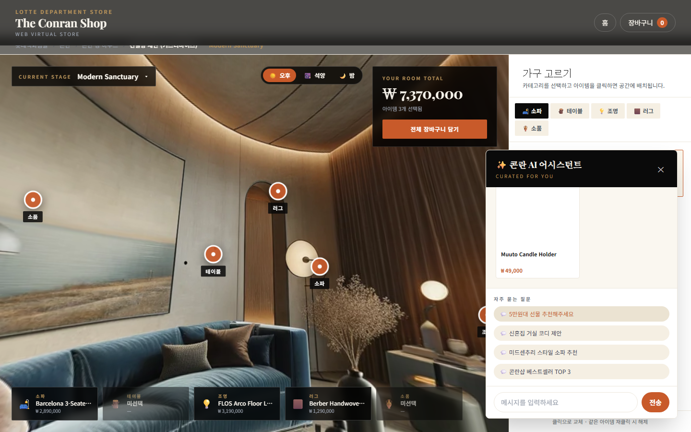

<!-- markdownlint-disable MD033 MD041 -->
<p align="center">
  
</p>

<h1 align="center">The Conran Shop × LOTTE · Web Virtual Store</h1>

<p align="center">
  <em>콘란 경의 하우스, 브라우저에서 거닐다.</em><br/>
  파노라마 + 인터랙티브 커머스 + AI 어시스턴트의 웹 버추얼 스토어 MVP.
</p>

<p align="center">
  <a href="https://github.com/heanuki0/virtualstore/actions/workflows/ci.yml"></a>
  
  
  
  
  
  
  
</p>

---

## 프로젝트 개요

롯데백화점이 운영 중인 **The Conran Shop** 매장을 웹 브라우저에서 360° 파노라마로 체험하고, 핫스팟 인터랙션을 통해 가구·조명·소품을 실시간으로 교체하며 롯데백화점몰 구매로 이어지는 **Web Virtual Store** MVP입니다.

- **서버 없이** 정적 파일만으로 동작 (S3 + CloudFront 배포 가정)
- **Marzipano** 360° equirectangular 파노라마 + 커스텀 DOM 핫스팟
- **4개 룸셋 × 3개 시간대** = 12개 AI 생성 파노라마 (DALL·E 3)
- **Preact + Signals** 기반 반응형 상태 관리, 초기 JS 33 KB gzip

기술 배경·의사결정 기록: 원본 스펙 문서는 사내 기획 트리에 있으며, 본 레포는 MVP 구현에 집중합니다.

---

## 스크린샷

### ① Exterior · 콘란 경의 하우스 입장
<p align="center">
  
</p>

### ② Customize · Marzipano 360° 파노라마 + 5개 핫스팟 + 시간대 토글
<p align="center">
  
</p>

### ③ AI Assistant · 프리셋 질문 → 상품 카드 추천
<p align="center">
  
</p>

---

## 빠른 시작

### 요구사항
- **Node.js 20+** · **npm 10+** (또는 pnpm 9)
- Python 3.12+ (AI 파노라마 재생성 시만 필요)
- Chrome/Edge 최신 2버전 권장

### 설치·실행

```bash
git clone https://github.com/heanuki0/virtualstore.git
cd virtualstore

# .env 설정 (비워도 동작, GA4 없이)
cp .env.example .env

npm install
npm run dev
# → http://localhost:5173
```

### 주요 스크립트

| 명령 | 설명 |
|------|------|
| `npm run dev` | Vite dev 서버 (HMR) |
| `npm run build` | `tsc --noEmit` 타입 체크 + 정적 번들 → `dist/` |
| `npm run preview` | 빌드 결과 로컬 프리뷰 (port 5180) |
| `npm run validate` | JSON 데이터 zod 스키마 + 교차 무결성 검증 |
| `npm run lint` | 타입 체크만 |

### 번들 예산 (실측)

| 자산 | Raw | gzip | 예산 |
|------|-----|------|-----|
| Initial JS (preact + index) | 92 KB | **33 KB** | ≤150 KB ✅ |
| CSS | 22 KB | 5.3 KB | ≤40 KB ✅ |
| Marzipano (lazy chunk) | 195 KB | 54 KB | Customize 진입 시만 로드 |
| 첫 파노라마 | — | ~170 KB | ≤3 MB ✅ |

---

## 기능

<table>
<tr>
<td width="50%" valign="top">

### 🏛️ 5개 씬 플로우
- **Exterior** — 콘란 경의 하우스 진입 카피
- **Gate** — 커스터마이즈 ↔ 전시형 분기
- **Customize** — 360° 파노라마 + 5 핫스팟 + 가구 교체
- **Gallery** — 4 룸셋 카드 + 스타일·가격 필터
- **RoomsetDetail** — 포함 상품 + 일괄 장바구니

</td>
<td width="50%" valign="top">

### 🎨 4 룸셋 × 3 무드
- **Modern Sanctuary** — 리비에라 모던
- **Classic English** — 런던 메이페어
- **Mid-Century Lounge** — 북유럽 60년대
- **Minimal Scandi** — 코펜하겐 미니멀
- 각 룸셋 × day / sunset / night **12개 AI 생성 equirectangular**

</td>
</tr>
<tr>
<td width="50%" valign="top">

### 🛋️ 커스터마이즈 인터랙션
- 5개 카테고리 (소파·테이블·조명·러그·소품)
- 핫스팟 클릭 → 상품 상세 오버레이
- "이 방에 배치하기" → 슬롯 즉시 반영
- 총액·선택 수 실시간 집계
- 룸셋 피커(좌상단)로 4 공간 전환

</td>
<td width="50%" valign="top">

### ✨ AI 어시스턴트
- 프리셋 4종:
  - 5만원대 선물 추천
  - 신혼집 거실 코디
  - 미드센추리 스타일 소파
  - 콘란샵 베스트셀러 TOP 3
- 타이핑 애니메이션 + 상품·룸셋 카드 응답
- 자유 입력 키워드 매칭 fallback

</td>
</tr>
</table>

---

## 기술 스택 및 아키텍처

```
┌──────────────────────────────────────────────────────────────┐
│  Delivery    정적 호스팅 (S3 + CloudFront · COOP/COEP 헤더)   │
├──────────────────────────────────────────────────────────────┤
│  Build       Vite 5 + TypeScript (noEmit) + pnpm/npm         │
├──────────────────────────────────────────────────────────────┤
│  Runtime     Preact 10 + @preact/signals    (컴포넌트 · 상태) │
│              Marzipano                       (파노라마 뷰어)   │
│              Tailwind 3 + CSS 변수           (콘란 테마 토큰)  │
├──────────────────────────────────────────────────────────────┤
│  Data        JSON + zod 스키마 · 빌드 타임 무결성 검증          │
├──────────────────────────────────────────────────────────────┤
│  Assets      DALL·E 3 equirectangular 1792×896  (12 파노라마)   │
└──────────────────────────────────────────────────────────────┘
           ↓                      ↓                   ↓
      GA4 (gtag)          외부 링크 아웃       localStorage
                      (lotteshopping.com)    (장바구니 · 세션)
```

| 레이어 | 라이브러리 | 선택 이유 |
|-------|---------|----------|
| UI | **Preact 10 + @preact/signals** | React API 호환 · 7 KB · Signals 반응형 |
| 뷰어 | **Marzipano 0.10** | Apache 2.0 · equirect/cube 모두 지원 · 핫스팟 내장 |
| 언어 | **TypeScript 5** strict | 런타임 에러 방지 |
| 스타일 | **Tailwind + CSS 변수** | 콘란 브랜드 토큰 (`tokens.css`) |
| 검증 | **zod** | 빌드·런타임 공통 스키마 |

---

## 디렉토리 구조

```
virtualstore/
├─ src/
│  ├─ App.tsx                 # 씬 라우터 (hash + signals)
│  ├─ main.tsx · vite-env.d.ts
│  ├─ scenes/                 # Exterior · Gate · Customize · Gallery · RoomsetDetail
│  ├─ components/             # HUD · Breadcrumb · ProductOverlay · AIAssistant
│  ├─ viewer/Marzipano.tsx    # Marzipano 래퍼 (equirect/cube 분기)
│  ├─ stores/                 # scene · cart · customize · overlay · ai (Signals)
│  ├─ data/                   # zod 스키마 + 로더
│  ├─ analytics/gtag.ts       # GA4 이벤트 래퍼
│  ├─ commerce/lotteHandOff.ts
│  └─ styles/                 # global.css · tokens.css (콘란 테마)
├─ public/
│  ├─ data/                   # products · rooms · ai-scenarios .json
│  └─ panos/R0{1..4}/         # equirect.webp · sunset.webp · night.webp · preview.jpg
├─ scripts/
│  ├─ generate-ai-panoramas.py   # DALL·E 3 파이프라인 (--variant day/sunset/night/all)
│  ├─ generate-test-panorama.py  # Pillow 합성 테스트 이미지 (API 키 없이)
│  ├─ panorama-prompts.md        # 4 스타일 프롬프트 시드
│  ├─ tile-panorama.md           # cube 타일화 레시피 (marzipano-tool)
│  ├─ validate-data.ts           # zod 스키마 CI 검증
│  └─ make-docs-assets.py        # README hero + 스크린샷 재생성
├─ docs/                       # hero.jpg + screenshots/*.png
├─ .env.example
├─ package.json · vite.config.ts · tsconfig.json
└─ tailwind.config.ts · postcss.config.js
```

---

## 콘텐츠 편집 가이드

모든 콘텐츠는 `public/data/*.json`과 `public/panos/*`만 수정하면 반영됩니다. zod 스키마가 오타를 빌드 타임에 차단합니다.

### 상품 추가
```json
// public/data/products.json
{
  "id": "P31",
  "name": "Flos IC F1 Floor Lamp",
  "cat": "light",
  "style": "modern",
  "price": 1890000,
  "desc": "...",
  "img": "/products/P31.webp",
  "lotteUrl": "https://www.lotteshopping.com/goods/P31"
}
```

### AI 시나리오 추가
```json
// public/data/ai-scenarios.json
{
  "trigger": "100만원대 조명 추천",
  "response": "...",
  "cards": ["P13", "P15", "P17"]
}
```

### 새 파노라마(룸셋) 추가

**방법 1 — DALL·E로 생성 (OpenAI 키 필요)**
```bash
# .env 에 OPENAI_API_KEY 설정 후
python scripts/generate-ai-panoramas.py --only R05 --variant all --quality hd
```

**방법 2 — 이미 준비된 equirectangular 이미지 사용**
1. `public/panos/R05/equirect.webp` (2:1 aspect, 권장 4096×2048)
2. `public/panos/R05/preview.jpg` (hero용)
3. `public/data/rooms.json`에 `R05` 블록 추가 + 핫스팟 yaw/pitch

편집 후:
```bash
npm run validate   # 스키마 · 교차 참조 검증
npm run dev        # 즉시 확인
```

---

## 환경 변수

| 키 | 용도 | 기본값 |
|---|----|------|
| `VITE_GA4_ID` | GA4 측정 ID | 없으면 이벤트는 콘솔에만 로깅 |
| `VITE_LOTTE_BASE` | 롯데백화점몰 base URL | `https://www.lotteshopping.com` |
| `VITE_LOTTE_CONRAN_CATEGORY` | 장바구니 일괄 이동 URL | 콘란 카테고리 |
| `OPENAI_API_KEY` | DALL·E 3 파노라마 생성 (로컬 스크립트 전용) | — |

---

## 이벤트 트래킹 (GA4)

| 이벤트 | 파라미터 | 트리거 |
|-------|---------|-------|
| `scene_view` | `scene_id` | 씬 전환 |
| `hotspot_click` | — | 파노라마 핫스팟 (구현 예정) |
| `slot_swap` | `category`, `product_id` | 커스터마이즈 슬롯 교체 |
| `roomset_stage_switch` | `roomset_id` | Customize 룸셋 피커 |
| `variant_switch` | `variant_id`, `roomset_id` | 시간대 토글 |
| `product_view` | `product_id`, `price`, `source` | 상품 오버레이 |
| `ai_query` | `trigger` | AI 질문 |
| `commerce_outbound` | `product_id`, `price`, `source` | 롯데몰 링크 클릭 |

---

## 로드맵

### 완료 (Phase 1 W1–W2)
- [x] Vite + Preact + TS + Tailwind 스캐폴드
- [x] zod 데이터 스키마 + CI 검증
- [x] 5개 씬 + 라우터 + 장바구니 + 분석
- [x] Marzipano 파노라마 + 핫스팟
- [x] ProductOverlay + AIAssistant 전역 컴포넌트
- [x] 룸셋 피커 (좌상단, 4개 전환)
- [x] DALL·E 3 파노라마 4룸셋 × 3시간대 = 12장

### 진행 중 / 남은 작업
- [x] GitHub Actions CI (`validate + build` + 번들 크기 리포트)
- [ ] 시간대 variant 전환 시 Marzipano 재초기화 안정화 (프로덕션 빌드 검증)
- [ ] `marzipano-tool`로 cube 타일화 → 고해상 줌 지원
- [ ] 상품 이미지 AI 생성 (현재 회색 플레이스홀더)
- [ ] GitHub Pages / Cloudflare Pages 자동 배포
- [ ] 모바일 반응형 · 터치 최적화
- [ ] 다국어 (한/영)
- [ ] 실제 아임포트/Shopify Buy Button 통합

## CI / 배포

모든 푸시와 PR은 [GitHub Actions](https://github.com/heanuki0/virtualstore/actions)에서 자동으로:

1. **Node 20 셋업** + `npm ci` (락 파일 기반 결정론적 설치)
2. **`npm run validate`** — zod 스키마 + 교차 참조 무결성
3. **`npm run build`** — `tsc --noEmit` + Vite 번들
4. **번들 크기 리포트** — 각 파일의 Raw/Gzip 크기를 Actions Summary에 표시
5. **`dist/` 아티팩트 업로드** (7일 보관) — 리뷰어가 PR 빌드 결과 다운로드·프리뷰 가능

PR에는 [템플릿](.github/PULL_REQUEST_TEMPLATE.md)이 자동 적용되어 변경 요지·확인 체크리스트를 맞춰 제출할 수 있습니다.

---

## 관련 링크

- **엘리펙스 코카콜라 팝업** — <https://elypecs.com/platform/coke/lotteon/hall.html>
- **EMPERIA 휴고보스 발리** — <https://emperiavr.com/project/boss-house-bali/>
- **하이마트 WebGL 데모** — <http://cts-caliverse.s3-website.ap-northeast-2.amazonaws.com/>
- **Marzipano 문서** — <https://www.marzipano.net/>
- **Preact Signals** — <https://preactjs.com/guide/v10/signals/>

---

## 라이선스

Private · 사내 보고·데모 용도.
외부 공개 시 콘란샵·롯데백화점·포함 상품 브랜드 자산의 사용 승인 별도 필요.

본 레포의 소스 코드는 MIT 라이선스 하에 재사용 가능하지만, `public/panos/*`에 포함된 AI 생성 이미지는 콘란샵 실제 매장과 무관한 참고용이며 상업적 재사용 시 OpenAI DALL·E 이용 약관을 확인해야 합니다.
